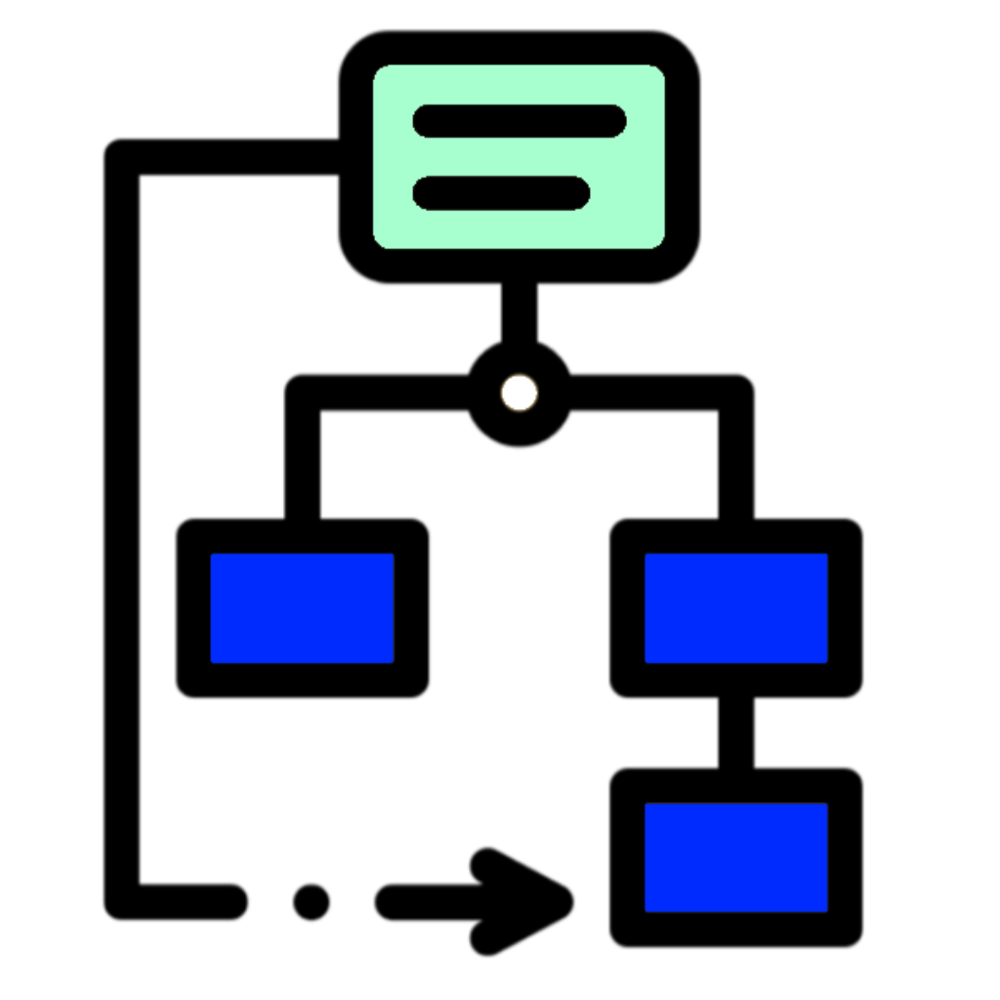
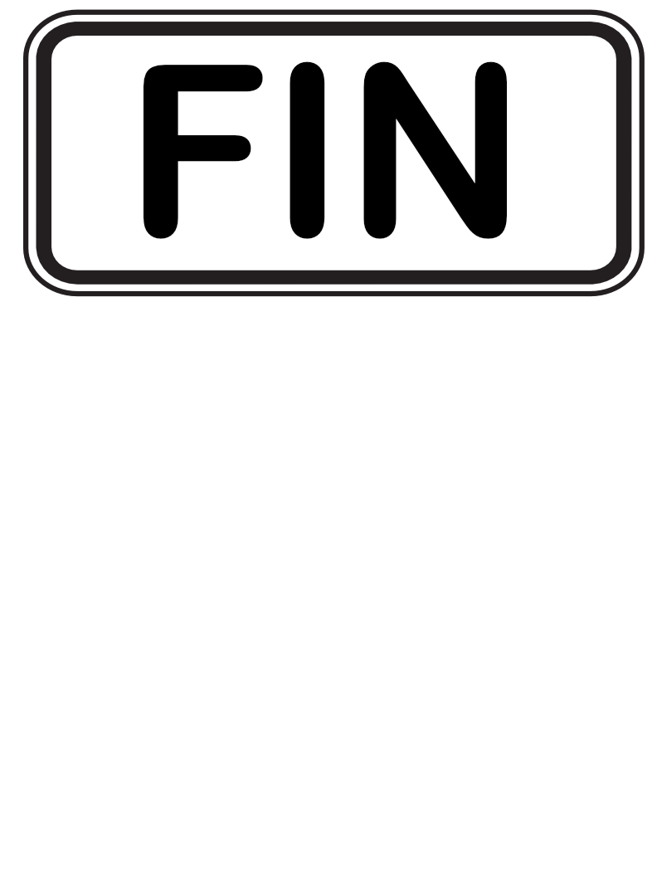

<h4 align="Center">1SY - Analyse Objet</h4>

# 🏋🏻‍♂️ Exercices 01 - Diagramme des cas d'utilisation

#### 📁 [Structure à utiliser](../../includes/rules.md)

## ⛽ Question 01 - Pétro Shawi
Programmez les mini-diagrammes de cas d'utilisation (UCD) suivants conformément à la structure à utiliser :

1. Un client prend un pistolet accroché à une pompe et appuie sur la gâchette pour prendre de l'essence. Quel est le diagramme associé à cet énoncé seul ?
2. Un pompiste peut enregistrer le paiement. Quel est le diagramme associé à cet énoncé seul ?
3. Créez un UCD en unissant les points 1 et 2 et en considérant qu'un pompiste peut également prendre de l'essence.
4. Certains pompistes sont aussi qualifiés pour effectuer des opérations de maintenance. Ils sont donc réparateurs en plus d'être pompistes. Copiez le numéro 3 et ajoutez-y cette nouvelle information.

> ⚠️ Ne considérez que ce qui est mentionné ici, rien de plus.

## 📚 Question 02 - Bibliothèque

Sur un terminal indépendant dans une bibliothèque, un client peut soit rechercher un livre, soit le réserver pour plus tard s'il n'est pas possible de l'emprunter, car il est déjà sorti.

Codez le diagramme de cas d'utilisation associé.

> ⚠️ Ne considérez que ce qui est mentionné ici, rien de plus.

## 🧾 Question 03 - Shamazon

Considérez les besoins suivants :

- Passer une commande (parfois urgente).
- Authentifier.
- Expédier une commande.

Passer une commande urgente est un cas particulier de passer une commande. Pour passer une commande, il faut nécessairement authentifier l'utilisateur.

Codez le diagramme de cas d'utilisation associé.

> ⚠️ Ne considérez que ce qui est mentionné ici, rien de plus.

## 📦 Question 04 - Alkatrak

Programmez le diagramme de cas d'utilisation du système `Alkatrak` de vente suivant :

1. Un client arrive à la caisse avec des articles.
2. Normalement, le caissier scanne chaque article individuellement, mais peut aussi entrer une quantité avant de scanner l'article.
3. `Alkatrak` affiche le prix de chaque article ainsi que son libellé.
4. Le client a passé tous les articles au caissier.
5. Le caissier indique alors à `Alkatrak` que tous les articles ont été scannés.
6. Le caissier souhaite alors enregistrer une vente. Pour ce faire :

    Le client présente son mode de paiement.
    - __Liquide__ : le caissier encaisse l'argent et le système indique le montant éventuel à rendre au client.
    - __Carte de débit__ : le client présente sa carte et le système communique avec l'institution financière afin de s'assurer de la présence des fonds.
    - __Carte de crédit__ : le client présente sa carte et le système transmet la demande à un centre d'autorisation de crédit.
7. `Alkatrak` imprime un reçu.
8. Le caissier transmet le reçu imprimé au client.
9. `Alkatrak` transmet les informations relatives aux articles vendus au système de gestion des stocks.
10. Un client peut présenter des coupons de réduction, mais cela doit obligatoirement être effectué avant le paiement.
11. Tous les matins, le responsable du magasin initialise les caisses pour la journée.

> 💡 Listez sur papier la liste des cas d'utilisation __pertinents__ avant de débuter dans PlantUML.

> 💡 Est-il possible que les clients vous donnent parfois plus d'informations que nécessaire ?

> ⚠️ Pour ce numéro, votre solution doit être fonctionnelle pour un __réel__ système de caisse (exemple : Super C).

## ❓ Question 05 - Créativité
Écrivez de petits énoncés de votre créativité, dont les éléments ne se trouvent pas dans les questions précédentes, où il sera obligatoire d'utiliser :
1. Énoncé 1 : Une inclusion `<<include>>`.
2. Énoncé 2 : Une extension `<<extend>>`.
3. Énoncé 3 : De la spécialisation (héritage).
4. Énoncé 4 : Un acteur externe.

